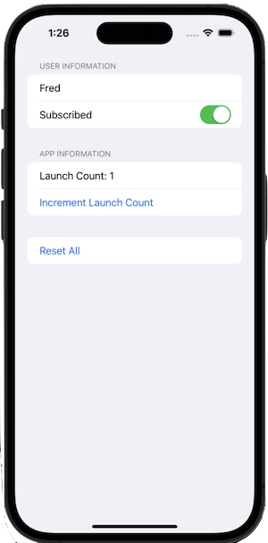

# UserDefaults Property Wrapper
This is a Swift / SwiftUI property wrapper that simplifies working with UserDefaults, allowing developers to use properties that automatically sync with UserDefaults.



The `UserDefault` property wrapper provides a convenient way to interact with `UserDefaults` in Swift. It simplifies the process of reading from and writing to `UserDefaults`, handling type safety and providing default values.

## Basic Usage

To use the `UserDefault` property wrapper, follow these steps:

1. Import the file containing the `UserDefault` struct into your Swift file.
2. Declare a property using the `@UserDefault` wrapper, specifying the key and default value.

Example:

```swift
class SettingsManager {
    @UserDefault("username", defaultValue: "")
    var username: String

    @UserDefault("isFirstLaunch", defaultValue: true)
    var isFirstLaunch: Bool

    @UserDefault("launchCount", defaultValue: 0)
    var launchCount: Int
}
```

Now you can use these properties as if they were normal variables, but they will automatically read from and write to `UserDefaults`.

```swift
let settings = SettingsManager()

// Reading
print(settings.username) // Prints the stored username or an empty string if not set

// Writing
settings.launchCount += 1 // Increments and saves the launch count
```

## Supported Types

The `UserDefault` wrapper supports the following types out of the box:

- Basic types (String, Int, Double, Bool, etc.)
- Arrays
- Dictionaries
- Custom types that conform to `Codable`

## Working with Arrays and Dictionaries

For arrays and dictionaries, use them as you would normally:

```swift
class SettingsManager {
    @UserDefault("favoriteColors", defaultValue: [])
    var favoriteColors: [String]

    @UserDefault("scores", defaultValue: [:])
    var scores: [String: Int]
}

let settings = SettingsManager()
settings.favoriteColors.append("Blue")
settings.scores["Level 1"] = 100
```

## Custom Codable Types

For custom types that conform to `Codable`, you can use them directly with the wrapper:

```swift
struct User: Codable {
    var name: String
    var age: Int
}

class UserManager {
    @UserDefault("currentUser", defaultValue: User(name: "", age: 0))
    var currentUser: User
}

let userManager = UserManager()
userManager.currentUser = User(name: "Alice", age: 30)
```

## Additional Features

### Checking for Existence

You can check if a value has been set in `UserDefaults` using the `hasValue` property:

```swift
if settings.$username.hasValue {
    print("Username has been set")
}
```

### Resetting to Default

To remove the stored value and revert to the default, use the `reset()` method:

```swift
settings.$username.reset()
```

## Best Practices

1. Choose unique and descriptive keys to avoid conflicts.
2. Use meaningful default values that make sense for your app's logic.
3. Consider centralizing your `UserDefault` declarations in a single place (like a `SettingsManager` class) for better organization.
4. Be cautious when storing sensitive information in `UserDefaults`, as it's not encrypted.

By using this `UserDefault` property wrapper, you can significantly simplify your code when working with `UserDefaults`, making it more readable and less error-prone.

See [Sample Xcode App](./UserDefaultWrapper/) for an example.